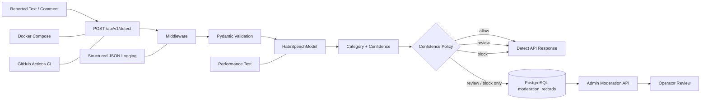

# AI Text Moderation Backend

[](https://github.com/bae-kh/text-moderation-api/actions/workflows/ci.yml)

한국어 유해 표현 분류 모델 [`smilegate-ai/kor_unsmile`](https://huggingface.co/smilegate-ai/kor_unsmile)을 FastAPI로 서빙하고, 모델의 `category`와 `confidence`를 서비스 정책으로 변환하는 AI Service Backend 프로젝트입니다.

`review`와 `block` 결과는 PostgreSQL에 저장되며, 인증된 Admin API를 통해 운영자가 검토 결과를 조회하고 수정할 수 있습니다.

## Highlights

- FastAPI lifespan 기반 모델 1회 로딩
- Pydantic 기반 입력 검증과 두 단계 길이 정책
- `run_in_threadpool` 기반 동기 추론 격리
- `allow / review / block` confidence policy
- PostgreSQL review queue와 Alembic migration
- X-API-Key 기반 Admin API
- Docker Compose 기반 API + DB 실행 환경
- GitHub Actions CI와 runtime health smoke test
- request ID 기반 structured JSON logging
- Locust scenario/stress test와 service pivot
- 60건 pilot dataset 기반 56개 threshold 조합 비교

---

## 1. Problem

모델을 로컬에서 실행하는 것과 실제 API 서비스로 운영하는 것은 다른 문제입니다.

이 프로젝트에서는 다음 항목을 함께 다뤘습니다.

- 잘못된 입력이 모델 계층까지 전달되지 않도록 validation
- 요청마다 모델을 다시 로드하지 않는 lifecycle 관리
- 동기 CPU inference와 FastAPI event loop 분리
- 모델 출력값을 서비스 action으로 변환하는 policy
- 검토가 필요한 결과를 저장하는 persistence layer
- 운영자 검토를 위한 Admin API
- Docker 기반 실행 환경과 CI
- latency, RPS, p95, p99를 포함한 성능 측정
- 민감한 원문을 제외한 structured logging
- threshold trade-off를 확인하는 pilot calibration

---

## 2. Architecture



```text
Text Input
→ Pydantic Validation
→ HateSpeechModel
→ category / confidence
→ allow / review / block
→ Detect API Response
→ review / block만 PostgreSQL 저장
→ Admin Review Workflow
```

---

## 3. Core Design

### 3.1 Model lifecycle

모델은 FastAPI lifespan에서 한 번 로드하고 `app.state.model`에 저장해 요청 간 재사용합니다.

```text
Application Start
→ FastAPI Lifespan
→ HateSpeechModel 1회 로드
→ app.state.model 저장
→ 요청 간 동일 인스턴스 재사용
```

### 3.2 Inference isolation

HuggingFace pipeline은 동기적인 CPU-bound 작업이므로 async endpoint에서 직접 실행하지 않고 threadpool로 분리했습니다.

```python
result = await run_in_threadpool(model.predict, request.text)
```

이 방식은 모델 연산을 비동기로 바꾸는 것이 아니라, FastAPI event loop와 동기 inference를 분리하는 목적입니다.

### 3.3 Input policy

```text
API input
- 최대 1000 characters
- 빈 문자열 / 공백 문자열 차단

Model input
- 최대 256 tokens
- truncation = True
```

API 계층의 문자 수 제한과 tokenizer 계층의 token 제한을 별도 방어선으로 구성했습니다.

---

## 4. Confidence Policy

| Top-1 Category | Confidence | Action | DB 저장 |
|---|---:|---|---|
| `clean` | `>= 0.80` | `allow` | X |
| `clean` | `< 0.80` | `review` | O |
| `non-clean` | `>= 0.65` | `block` | O |
| `non-clean` | `< 0.65` | `review` | O |

정책 의도:

- `clean` 예측이라도 confidence가 낮으면 자동 허용하지 않음
- `non-clean` 예측이라도 confidence가 낮으면 바로 차단하지 않음
- 자동 판단이 어려운 구간을 review queue로 분리
- `allow`는 응답만 반환하고 `review`와 `block`만 저장

threshold는 `pydantic-settings` 기반 환경변수로 주입할 수 있습니다.

---

## 5. Quick Start

### 5.1 Clone

```bash
git clone https://github.com/bae-kh/text-moderation-api.git
cd text-moderation-api
```

### 5.2 Environment

```bash
cp .env.example .env
```

`.env`에서 관리자 API key와 DB 설정을 확인합니다.

### 5.3 Run with Docker Compose

```bash
docker compose up --build
```

첫 실행 시 HuggingFace 모델 다운로드로 시간이 걸릴 수 있습니다. 이후 실행부터는 model cache volume을 재사용합니다.

Swagger UI:

```text
http://localhost:8000/docs
```

### 5.4 Stop

```bash
docker compose down
```

DB volume까지 초기화하려면:

```bash
docker compose down -v
```

---

## 6. API

### 6.1 Health

```bash
curl http://localhost:8000/api/v1/health
```

```json
{
  "status": "ok",
  "model_loaded": true,
  "db_connected": true
}
```

| Field | Description |
|---|---|
| `status` | API server status |
| `model_loaded` | 모델 로딩 여부 |
| `db_connected` | DB 연결 여부 |

### 6.2 Detect

```bash
curl -X POST http://localhost:8000/api/v1/detect \
  -H "Content-Type: application/json" \
  -d '{"text": "오늘 날씨가 정말 좋네요"}'
```

```json
{
  "is_hate_speech": false,
  "confidence": 0.98,
  "category": "clean",
  "action": "allow",
  "message": "allowed"
}
```

README에서는 유해 표현 원문 노출을 피하기 위해 정상 텍스트 예시만 제공합니다.

### 6.3 Review Queue

```bash
curl "http://localhost:8000/api/v1/moderation/records?status=pending&limit=20&offset=0" \
  -H "X-API-Key: <YOUR_ADMIN_API_KEY>"
```

관리자 API key는 `.env.example`을 참고해 환경변수로 설정합니다.

### 6.4 Admin API

| Method | Endpoint | Description |
|---|---|---|
| GET | `/api/v1/moderation/records` | 목록 조회, pagination/filter 지원 |
| GET | `/api/v1/moderation/records/{record_id}` | 상세 조회 |
| PATCH | `/api/v1/moderation/records/{record_id}` | 운영자 검토 결과 수정 |

PATCH request:

```json
{
  "review_result": "confirmed_harmful",
  "review_note": "운영자 검토 결과 유해 표현으로 판단"
}
```

Auth error:

| Status | Meaning |
|---|---|
| `401` | `X-API-Key` header 없음 |
| `403` | API key 불일치 |

---

## 7. Persistence and Migration

`review` 또는 `block` 결과는 PostgreSQL `moderation_records`에 저장합니다. `allow` 결과는 응답만 반환하고 저장하지 않습니다.

| Field | Description |
|---|---|
| `id` | record ID |
| `text` | 운영자 검토 대상 원문 |
| `category` | top category |
| `confidence` | confidence score |
| `action` | `review` / `block` |
| `status` | `pending` / `resolved` |
| `review_result` | 운영자 최종 판단 |
| `review_note` | 운영자 메모 |
| `created_at`, `updated_at` | 생성·수정 시각 |

PostgreSQL schema 변경은 Alembic revision으로 관리합니다.

> 원문은 review workflow를 위해 DB에 저장하지만 structured log에는 기록하지 않습니다. 실제 production에서는 encryption, retention, masking, deletion policy가 추가로 필요합니다.

---

## 8. Testing and CI

### Test strategy

| Test Type | Scope | Tool |
|---|---|---|
| Unit Test | model service, confidence policy | pytest + MagicMock |
| API Contract | request/response, validation | pytest + TestClient |
| Auth / Pagination / Filter | Admin API | pytest + TestClient |
| Docker Build | image build | Docker |
| Runtime Smoke Test | container + Health API | Docker + curl |
| Model Smoke Test | 실제 모델 inference | manual workflow |
| Load Test | scenario/stress | Locust |

최종 자동화 테스트는 **28개가 통과**했습니다.

### CI flow

```text
push / pull request
→ Python setup
→ dependency install
→ pytest
→ Docker image build
→ container run
→ GET /api/v1/health
→ HTTP 200
→ status == "ok"
→ model_loaded == true
→ db_connected == true
```

실제 모델 inference를 포함하는 Detect API smoke test는 HuggingFace model loading과 CPU inference 비용이 크기 때문에 manual workflow로 분리했습니다.

---

## 9. Performance Test

### Environment

| Item | Value |
|---|---|
| Purpose | CPU-only 환경에서 동시 요청 증가에 따른 latency/RPS 변화 확인 |
| CPU | Intel Core i9-13900K |
| RAM | 32GB |
| GPU | 사용하지 않음 |
| Run mode | local uvicorn |
| Model | `smilegate-ai/kor_unsmile` |
| Tools | custom latency script, Locust |

### Warm latency

| Input | Avg | Min | Max |
|---|---:|---:|---:|
| Short text | 약 30.05ms | 약 16.49ms | 약 53.60ms |
| Long text | 약 87.19ms | 약 77.83ms | 약 96.63ms |

### Scenario load test

요청 후 1~3초 대기를 적용해 신고·댓글 moderation 흐름을 가정했습니다.

| Users | Avg | p95 | p99 | RPS | Failure |
|---:|---:|---:|---:|---:|---:|
| 1 | 약 73.89ms | 130ms | 130ms | 0.51 | 0% |
| 5 | 약 91.96ms | 150ms | 150ms | 2.41 | 0% |
| 10 | 약 89.60ms | 150ms | 170ms | 4.46 | 0% |
| 20 | **약 92.91ms** | 180ms | 200ms | 8.99 | 0% |

### No-wait stress test

| Users | Avg | p95 | p99 | RPS | Failure |
|---:|---:|---:|---:|---:|---:|
| 5 | 약 77.22ms | 82ms | 89ms | 62.43 | 0% |
| 10 | 약 190.85ms | 220ms | 240ms | 48.27 | 0% |
| 20 | 약 398.98ms | 500ms | 550ms | 45.98 | 0% |

### Interpretation

Scenario test에서는 20 users까지 평균 약 88ms, p99 약 200ms, failure 0%를 확인했습니다.

반면 no-wait stress test에서는 동시 요청이 증가하면서 latency가 상승하고 RPS가 5 users 이후 감소했습니다. 현재 CPU-only 단일 API 구조에서 model inference가 병목으로 작동한 결과로 해석했습니다.

---

## 10. Pivot Decision

초기 목표는 실시간 게임 채팅 사전 차단 API였습니다.

그러나 실시간 차단은 평균 latency뿐 아니라 p95/p99 tail latency, 순간 트래픽, timeout, fallback, 수평 확장까지 함께 고려해야 합니다.

현재 CPU-only 구조에서는 신고 텍스트·댓글 moderation과 운영자 review queue가 더 현실적인 1차 target이라고 판단했습니다.

```text
Before
- 실시간 게임 채팅 사전 차단

After
- 신고 텍스트 / 댓글 moderation
- block / review 결과 운영자 검토
```

향후 ONNX Runtime, quantization, batching, caching, GPU inference 등을 적용한 뒤 실시간 적용 가능성을 다시 검토할 수 있습니다.

---

## 11. Threshold Calibration

60건 pilot dataset(`clean` 30, `harmful` 30)을 사용해 **56개 threshold 조합**을 비교했습니다.

현재 threshold:

```text
clean_allow_threshold = 0.80
harmful_block_threshold = 0.65
```

| Metric | Value |
|---|---:|
| Auto-block Precision | 100.0% |
| Auto-block Recall | 56.7% |
| Auto-block F1 | 72.3% |
| Safety Coverage | 73.3% |
| Harmful Allow Rate | 26.7% |
| Review Rate | 10.0% |

선택 기준:

1. 정상 텍스트 자동 차단 위험을 보수적으로 관리
2. review rate를 과도하게 높이지 않음
3. pilot 결과만으로 aggressive block policy를 확정하지 않음
4. 실제 review result가 쌓이면 threshold 재조정

현재 값은 production 최적값이 아니라 review workflow를 관찰하기 위한 baseline입니다.

- [Threshold Calibration Report](./calibration_results/calibration_report.md)

---

## 12. Structured Logging

Detect 요청마다 JSON structured log를 기록합니다.

```json
{
  "event": "detect_completed",
  "request_id": "7b740556-41ce-4b2c-9201-d9d3a77e203e",
  "method": "POST",
  "path": "/api/v1/detect",
  "status_code": 200,
  "latency_ms": 693.17,
  "text_length": 4,
  "category": "악플/욕설",
  "confidence": 0.7818,
  "action": "block",
  "stored": true
}
```

Logging policy:

- raw text는 로그에 저장하지 않음
- `text_length`, `category`, `confidence`, `action`, `latency_ms`만 기록
- `request_id`를 통해 요청 단위 추적
- 원문은 review workflow를 위해 DB에만 저장

---

## 13. Project Structure

```text
text-moderation-api/
├── .github/
│   └── workflows/              # CI + manual model smoke test
├── alembic/                    # schema migration revisions
├── app/
│   ├── api/                    # health, detect, moderation routes
│   ├── core/                   # config, security, exceptions, logging
│   ├── db/                     # DB connection and models
│   ├── schemas/                # Pydantic schemas
│   ├── services/               # model and moderation services
│   └── main.py                 # FastAPI app + lifespan + middleware
├── assets/                     # screenshots and documentation assets
├── calibration_results/        # threshold report and raw results
├── load_test_results/          # performance results
├── load_tests/                 # Locust scenarios
├── scripts/                    # inspection and utility scripts
├── tests/                      # pytest
├── .dockerignore
├── .env.example
├── .gitignore
├── Dockerfile
├── alembic.ini
├── docker-compose.yml
├── requirements.txt
├── requirements-dev.txt
└── README.md
```

---

## 14. Agentic AI Usage

Agentic AI는 pair programming과 문서화 보조 도구로 사용했습니다.

활용 범위:

- boilerplate 초안
- test case 아이디어
- Docker/CI 설정 초안
- debugging 방향 탐색
- 성능·calibration 결과 정리
- README와 문서 구조화

직접 판단한 항목:

- `allow / review / block` policy
- review queue 구조
- raw text 미로깅
- 실시간 차단에서 review workflow로의 pivot
- calibration 결과를 baseline으로 해석한 기준
- 포트폴리오에서 주장 가능한 범위

생성된 코드는 pytest, Docker Compose, API 호출, container log, DB record, Locust 결과로 검증했습니다.

---

## 15. Limitations

- 완전한 MLOps platform은 아님
- model registry, drift monitoring, continuous training 미구현
- 제한된 local CPU-only 환경에서 성능 측정
- 실시간 대규모 채팅 차단에는 추가 최적화 필요
- X-API-Key는 MVP 수준의 관리자 인증
- calibration은 60건 pilot dataset 기준
- 운영자 UI는 없고 Admin API만 제공
- cloud deployment 미진행
- production-grade observability와 개인정보 정책 미구현

---

## 16. Future Work

- 운영자 review 결과 기반 threshold 재측정
- category별 threshold
- ONNX Runtime
- dynamic quantization
- Redis caching
- batch inference
- GPU inference service
- worker/thread tuning
- Prometheus/Grafana
- model registry
- cloud deployment

---

## 17. Evidence

- [GitHub Actions](https://github.com/bae-kh/text-moderation-api/actions)
- [Calibration Report](./calibration_results/calibration_report.md)
- [Load Test Results](./load_test_results/performance_result.png)
- [Execution Evidence](./assets/detect_response.png)

---

## 18. Troubleshooting

<details>
<summary>PyTorch CUDA dependency issue</summary>

일반 `torch` dependency 설치 시 불필요한 CUDA package가 포함될 수 있어 Dockerfile에서 CPU-only PyTorch wheel을 설치했습니다.

</details>

<details>
<summary>NumPy runtime compatibility issue</summary>

PyTorch CPU wheel과 NumPy 호환성 문제로 `numpy==1.26.4`를 고정했습니다.

</details>

<details>
<summary>API와 model inspection script 결과 불일치</summary>

HuggingFace pipeline 설정이 달라 confidence 값이 다르게 나온 문제를 확인하고, API와 inspection script의 softmax 기반 설정을 일치시켰습니다.

</details>

<details>
<summary>PowerShell 한국어 JSON 인코딩 문제</summary>

```powershell
$body = [System.Text.Encoding]::UTF8.GetBytes('{"text": "검사할 텍스트"}')
Invoke-RestMethod -Uri http://localhost:8000/api/v1/detect `
  -Method POST -Body $body -ContentType "application/json; charset=utf-8"
```

</details>
